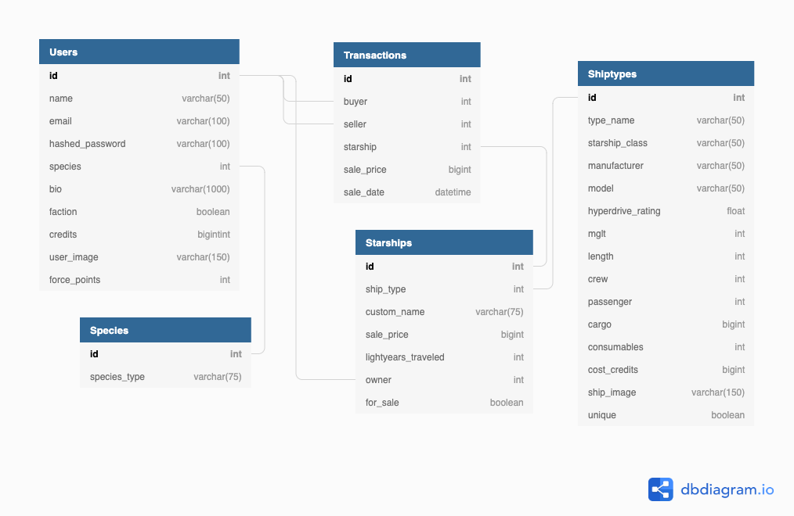

A long time ago in a galaxy far far away...

They needed a platform to sell used starships...

# WELCOME TO STAR TRADER SERVER

## MVP
- Ability to create new users and have user login with authorization
- Users can buy and sell starships (include unique special ships)
- Users can post new starships for sale (only basic not unique)
- Users can search for starships by starship class interface bar

## BONUS / STRETCH GOALS
- user comments on starships up for sale
- user ratings (⭐️⭐️⭐️⭐️)
- light and dark side (light/dark mode)
- language translation (yoda speak and sith speak)
- mapping for where in galaxy starships are located
- way to earn credits (mingame?)

## TECHNOLOGIES USED
- Python/Flask
- React
- PSQL Database
- ARWES Front End Library (https://arwes.dev/)
- SWAPI Star Wars API (https://swapi.dev/)

## DATABASE SCHEMA & MODELS

### TABLE USERS
- id (integer, primary key)
- name (string, not null)
- email (string, unique, not null)
- hashed_password (string, not null)
- species (integer, foreign key, not null)
- bio (string)
- faction (boolean, default = false)
- credits (big integer, not null)
- user_image (string, not null)
- force_points (integer, default = 0) (like a seller rating)

### TABLE SPECIES
- id (integer, primary key)
- species_type (string, not null)

### TABLE SHIPTYPES
- id (primaryhey, integer)
- type_name (string, not null)
- starship_class (string, not null)
- manufacturer (string, not null)
- model (string, not null)
- hyperdrive_rating (float, not null)
- mglt (integer, not null)
- length (integer, not null)
- crew (integer, not null)
- cargo (big integer, not null)
- consumabes (string, not null)
- cost_credits (big integer, not null)
- ship_image (string, not null)
- unique (boolean, default = false)

### TABLE STARSHIPS
- id (integer, primary key)
- ship_type (integer, foreign key)
- custom_name (string)
- sale_price (big integer, not null)
- lightyears_traveled (integer, not null)
- owner (integer, foreign key)
- for_sale (boolean, default = true)
- post_date (date, not null)

### TABLE TRANSACTIONS
- id (integer, primaru key)
- buyer (integer, foreign key)
- seller (integer, foreign key)
- starship (integer, foreign key)
- sale_price (big integer, not null)
- sale_date (date, not null)

## BACKEND ROUTES
### USERS
- login route (GET & POST)
- add user (GET & POST)
- get user info (GET)
- update user (GET & POST) #stretch goal
- add funds (GET & POST) #stretch goal

### STARSHIPS
- get all ships (GET)
- get ships by class (GET)
- get one ship by id (GET)

### TRANSACTIONS
- add ship for sale (GET & POST)
- sell ship (GET & POST)

